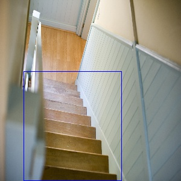
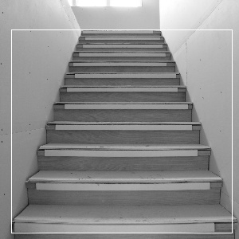

# Real Time Detection of Stairs

This *git repository* is the joint project of six students
for the *Service Analytics A* lecture of 
the summer term 2020 at KIT. 

### Contents
- [1 Use Case and Motivation](#1-use-case-and-motivation)
- [2 Project Organization](#2-project-organization)
- [3 Data Gathering and Labelling](#3-data-gathering-and-labelling)
- [4 Data Preprocessing](#4-data-preprocessing)
  - [4.1 Data Loading](#41-data-loading)
  - [4.2 Core Preprocessing](#42-core-preprocessing)
  - [4.3 Data Augmentation](#43-data-augmentation)
- [5 Modeling and Evaluation](#5-modeling-and-evaluation)
  - [5.1 Model Types and Selection](#51-model-types-and-selection)
  - [5.2 Faster R-CNN and SSD Mobilenet-V2 (Tensorflow Object Detection API)](#52-faster-r-cnn-and-ssd-mobilenet-v2-tensorflow-object-detection-api)
  - [5.3 Tiny-YOLO](#53-tiny-yolo)
- [6 Results](#6-results)
- [7 Deployment: Jetson Nano](#7-deployment-jetson-nano)
  - [7.1 Assembly](#71-assembly)
  - [7.2 Setup](#72-setup)
  - [7.3 Software installation](#73-software-installation)
  - [7.4 Jetson Nano in Action](#74-jetson-nano-in-action)
- [8 Demo Videos and Concluding Remarks](#8-demo-videos-and-concluding-remarks)

## 1 Use Case and Motivation

Our group decided to develop a use case that could serve the society free of 
charge via an open source platform. 
After brainstorming several ideas it soon became obvious that the best target 
group to help with an object detection challenge (which is all about vision)
would be to **help visually impaired people**. One of their common	problems the 
detection of obstacles in urban environments (*Fig 1.1*) [In Germany there are 
more than 350.000 people with major visual impairment](https://de.statista.com/statistik/daten/studie/247948/umfrage/anzahl-der-sehbehinderten-in-deutschland-nach-schwere-der-behinderung/).
Therefore this is a use case that could make a difference in the lives of 
thousands of people not only in Germany but 285 million worldwide. 

<figure>

<figcaption> Fig 1.1 [Obstacles for visually impaired persons in an urban environment](https://www.storyblocks.com/video/stock/blind-man-climbing-stairs-in-city-park-sdmvpuvzbj3p5wv7z)</figcaption>
</figure>

A brief literature review revealed that several solutions for stair detection 
have already been developed. 

[Habib et al.](https://www.google.com/url?sa=t&rct=j&q=&esrc=s&source=web&cd=&ved=2ahUKEwirhdGixpTrAhUDCewKHY0DBqcQFjANegQIAxAB&url=http%3A%2F%2Fwww.iieta.org%2Fdownload%2Ffile%2Ffid%2F21268&usg=AOvVaw21lRYBvCrO8uEghyyMD1c3) 
used an ultrasonic sensor, an R-GBD camera, a raspberry pi and a buzzer fixed 
on a walking stick as a system setup and Faster R-CNN architecture to detect 
upward and downward stairs quite accurately. 

[Harms et al.](https://www.mrt.kit.edu/z/publ/download/harms/StairDetection/2015_Harms_StairDetection.pdf) 
used using Stereo Vision to reconstruct a 3D point cloud of stairs to provide even 
more accurate information for visually impaired persons. Their stereocamera rig 
and the IMU is integrated into a helmet.

Another possible application of this object detection model is
the **real time stair detection for autonomous robots to avoid them from falling 
down stairs and being damaged**. As *Fig. 1.2* visualizes with a security robot 
in a mall in the USA this is still an issue even nowadays and could be solved 
relatively easily with the proposed object detection model. Once a robot approaches
stairs certain safety protocols could be triggered and the robot stopped before
it falls down the stairs.

<figure>

<figcaption> Fig 1.2 [Robot accident due to undetected stairs](https://arstechnica.com/gadgets/2017/07/knightscope-k5-security-bot-drowned/)</figcaption>
</figure>

We believe that it is of very high importance to consider the requirements of 
visually impaired persons and for example not use a helmet setup that may be 
unpractical in warm weather, uncomfortable, or embarrassing to wear in public. 
Therefore, we contacted the Center for visually impaired Nürnberg
(Bildungszentrum für Blinde und Sehbehinderte Nürnberg, (BBS)) for feedback and 
usability questions on our case study. 

The following section summarizes our conversations with the **BBS** and 
the questions arising for the users of such a system. 

**BBS:** Object recognition is an important topic, especially in the field of 
orientation and mobility, e.g. to identify potential danger spots. But we 
still need some background information to help you better.

**BBS:** Is the microcomputer mobile / portable?

**Our answer:** The microcomputer is relatively small, about the size 
of a wallet and made for mobile applications.

**BBS:** How big is the device and how heavy is it?  The field of application would also depend on this.

**Our answer:** Here is a picture of the microcomputer without water-repellent housing,
which does not enlarge the device significantly. It weighs about 136 grams.

**BBS:** Is it an extra device or can the software work with an app on the mobile phone?

**Our answer:** At the current stage of development this device is relatively well suited 
for object recognition prototyping, but as soon as the development
is completed it will be possible to use the software on any modern smartphone 
equipped with a camera.

**BBS:** Can it be mounted on a long pole?

**Our answer:** The device could be relatively easy mounted on a pole with a few screws ,
if the additional weight does not bother the user. Alternatively the idea would
have been to put the device in a backpack/bag.

**BBS:** How is the operation of the device?

**Our answer:** The goal is that the end user has to deal with the technical details as little 
as possible and the software automatically sends e.g. acoustic signals/voice 
warnings if a "dangerous" object is detected.

**BBS:** Can the software also detect objects at height e.g. signs at head height

**Our answer:** The height itself is not a problem, it might just be necessary to connect more
than one camera and mount them at different angles to capture all angles and
heights. Since the cameras for the device are about the size of 1 cent coins 
this would not be a problem. With a smartphone camera you would then 
unfortunately be limited by the "field of view" of the smartphone camera.

**BBS:** How wide/thick does an object have to be for it to be recognized? (railway barriers or bicycle stand)

**Our answer:** The width/thickness of the objects is not a problem, but they should be 
reasonably easy to see with the human eye, which in the case of railway 
barriers is not an issue due to the distinct color. In general our software works 
like this: First we have to collect training data, i.e. photos of the objects 
the computer should recognize. Then we label these pictures in a certain way, 
so you tell the computer on this picture you see a railway barrier, on this one 
there is a staircase and so on. So he can roughly tell the computer the 
characteristics for the respective object in the pictures. When he is in a
new environment and sees objects live on video through the camera, he will 
compare them with his "experiences" and recognize the object that is in 
front of his lens.

Based on this the BBS gave us very valuable feedback for our use case:

"There are already various detection softwares available, such as the App 
Seeing AI and also long poles with obstacle detection, for example from 
[Vistac](http://www.laserlangstock.de/lala.shtml)

Usually ultrasonic or laser technology is used here. Both require the user to 
hold a long pole. This must be practiced, because when the 
handle is turned the alignment is incorrect and obstacles are announced which 
are not obstacles in reality (e.g. the own leg).
The long pole is oscillated back and forth in front of the body when used 
"correctly". The pendulum swing should be across the widest part of the body. 
If a device is mounted on the long pole, it must be taken into account that the
long pole moves and that the angle can change both forwards and sideways.
The question is also how far the detection radius of your device should be, 
objects that are 1 meter to the right or left of the person are not of interest
if it is only about obstacle detection.
Acoustics play an important role in orientation and mobility of visually impaired, because the 
environmental and structural conditions are analyzed constantly. In practice this means 
that for example slowing down and standing traffic can indicate a traffic light
or the acoustic change at house entrances can indicate such a red traffic light. 
The sounds or instructions that the device emits must therefore be well dosed. "


Based on this feedback we decided to pursue this use case, because there is no
open source software that actually detects explicitly upward und downward stairs 
for visually impaired persons. The BBS showed quite some interest into our 
solution and would be open to a test run once the COVID situation improves.
Therefore, in later developement stages the Jetson Nano could be mounted onto a 
long pole as visulized below. (Fig 1.3)

<figure>

<figcaption> Fig 1.3 [Possible long pole setup](https://www.google.com/url?sa=t&rct=j&q=&esrc=s&source=web&cd=&ved=2ahUKEwirhdGixpTrAhUDCewKHY0DBqcQFjANegQIAxAB&url=http%3A%2F%2Fwww.iieta.org%2Fdownload%2Ffile%2Ffid%2F21268&usg=AOvVaw21lRYBvCrO8uEghyyMD1c3)</figcaption>
</figure>

Other possible extension to the object detection model could be to include other relevant
classes like bike stands, trash cans or electric cars that are much harder to be
recognized by visually impaired due the reduced acoustic emissions.


## 2 Project Organization

Our goal was to **go through all stages of a machine learning project from business understanding to deployment**. 
In order to provide some structure and to ensure good quality we decided to define several **expert roles** within the team. 
These roles allowed each team member to mainly focus on a specific task, while still working closely together with others 
wherever collaboration was beneficial. **Weekly team meetings** ensured that everyone could pitch his or her ideas and that 
we could keep track on our progress, as well as problems, and help each other whenever necessary. <br>
<br>
The expert roles and responsibilities were defined as follows:
- Use Case: Michael
- Data Gathering & Labelling: Tim
- Data Preprocessing
  * Core Preprocessing: Daniel
  * Data Augmentation: Kamilla
- Modelling
  * Tensorflow Models: Lukas, Max
  * Tiny-YOLO: Tim
- Deployment: Michael
- Final Product Video: Kamilla
- Project & Team Organization: Daniel

## 3 Data Gathering and Labelling

For the processing of an object recognition task, the first requirement for starting is always a set of images with
the various objects to be recognized. A well-known hurdle is that object recognition models require an enormous amount
of images if they have to be trained thoroughly. Since we do not have the time to collect training data for months 
during this semester course, we use already pre-trained models (more on that in the [Modeling](#5-modeling-and-evaluation) section).
However, we still need about 1,000 images to get a well-functioning model. Furthermore, [data augmentation](#43-data-augmentation) allows us to grow the data set without additional labelling effort.
To achieve this, we took our smartphone and collected a lot of pictures of stairs under different conditions (inside, outside, up, down etc.). 
In total, **more than 350 pictures of our data set were taken by ourselves**.
This is already quite a lot, but we assumed that we would need more pictures for the training. 
Therefore, we also used the internet and **retrieved images automatically**. First we used image platforms with
a freely accessible offer like *pixabay* or *unsplash* to download images of stairs. Furthermore we also scraped images
from different services. For this we started to use open data from *Wikidata* and *dbpedia*. Both provide an API
to query data via *SPARQ*L (code can be found in [dbpedia sparql query](/ImageScraping/dbpedia_sparql_query.txt) and [query_images_wikidata](/ImageScraping/query_images_wikidata.py)).
Another approach we use is to collect images from the *Microsoft bing API* (see [query_images_bing.py](/ImageScraping/query_images_bing.py)). Here we used different keywords like `stairs`, `outdoor stairs`, etc.
Finally, **we have collected more than a thousand images in total**.

<figure>

<figcaption>Overview of all sources of images of the data set and their quantity </figcaption>
</figure>

Collecting such a huge amount of images is quite difficult, but to start training an object recognition algorithm,
one step is still missing: the labeling. 
To recognize an object, we have to teach the algorithm what the objects we are interested in.
So we have to mark stairs in our images and provide them with labels. This is called labeling. <br>
In image processing, there are many different methods to label an image. The simplest one is to assign only a label
to every image, e.g. `dog`. However, this is only suitable for the classification of images;
more sophisticated identification techniques are required for object recognition.
One of the best known is **bounding boxes**, which are rectangles (or three-dimensional cuboids) that cover the shape of the object.
Polygons can be described as an extension of the Bounding Box, in which the shape of an object is attempted
to be modelled as accurately as possible by complex polygons. The highest level of detail is used in **semantic segmentation**
where every pixel is assigned to a class.
<figure>

<figcaption> upper left: bounding boxes, upper right: cuboid bounding boxes, lower left: polygons, lower right: semantic labeling ([source](https://towardsdatascience.com/image-data-labelling-and-annotation-everything-you-need-to-know-86ede6c684b1))</figcaption>
</figure>

As our use case is relatively simple, we decided to work with bounding boxes.
We could also use polygons, which would possibly lead to better results, but also means much more effort in labeling
and preprocessing, which would go beyond the scope of this semester project.
Below you can see an example image from our data set and the corresponding labeling.

<div style="text-align: center" >

</div>

The **labeling is a high manual effort** and requires a lot of time, so we decided to **limit our data set to 1,000 images**.
although it would have been easy to get many more images by scraping.
<br>

There is a wide range of labeling tools, both free of charge and for a fee, that we could use.
For this project we have considered the following:

 - [VGG Image Annotator](https://www.robots.ox.ac.uk/~vgg/software/via/via-2.0.5.html)
 - [Labelbox](https://labelbox.com/)
 - [LabelMe](https://labelme2.csail.mit.edu/)
 - [Pigeon](https://github.com/sugi-chan/multi_label_pigeon)
 - [LabelImg](https://github.com/tzutalin/labelImg)

In the end, we chose *LabelMe* because it is a **browser-based and freely usable tool** that allows us to label images together without moving files around.
The labelled images can be accessed with the following access data:


```
user: serviceAnalytics
password: ServiceAnalytics2020
```

To obtain consistent labels, we agreed to use `stairs` as object name and to enter `up` or `down` as attribute.
This allows us to retrieve both level of detail and to flexibly choose which ones we want to work with.
In addition, we were guided by the following best practices, which we condensed from various sources and reports:

- Decide for each image whether it is useful -> otherwise delete
- Images must be at least 300 px in height and width
- Do not cut off objects, prefer a little more background
- If object is obscured, label as if you can see it clearly

<br>

## 4 Data Preprocessing

In a very early stage of our project we came to the decision that we want to treat the **data preprocessing as a seperate 
task from the modelling**. The alternative would have been to write a preprocessing script for each of the models. We
considered that approach due to the fact that the different models require their input data in different formats. However,
there would have still been a lot of duplicated code, so we decided to instead divide the preprocessing into small **micro-functions**
that can be orchestrated by a preprocessing script in a way that all models can use it. <br>
<br>
We treated our preprocessing development as an **iterative process**. First, the preprocessing team provided very basic 
functions to load the *LabelMe* images and annotations and to transform them into python structures like *numpy matrices* (images)
and *python dictionaries* (annotations). In a second step, the modelling team defined a **wish list** which contained additional 
functions and formats they needed for their models and gave feedback on the existing components. The preprocessing team then,
in turn, used this feedback for the next development iteration, which was again completed by another round of feedback and wishes. 
Our experience with this method was very good, as it allowed us to define expert roles that mostly dealt with preprocessing, 
while still making sure that the models got their input data in a way that satisfies all the individual requirements. <br>
<br>

### 4.1 Data Loading

The first step in the preprocessing part is the [DataLoading.py](Preprocessing/DataLoading.py) module. In order to use its functionality, one has to download
all required collections from *LabelMe* and store all the `.tar.gz` files in one input folder (`inputDir`). Then the user can call the
`load_data` function.
```
def load_data(inputDir, outputDir, train=50, valid=20, test=30):
    # Validate input args
    assert os.path.isdir(inputDir)

    # unpack all files from LabelMe
    unpack_label_me(inputDir, outputDir)

    # assign files to train, test and validation set
    weights = [train, valid, test]
    train_test_valid_split(outputDir, weights=weights)
```
This function serves two purposes. First, it extracts all the data (images and annotations) from the `.tar.gz` files by calling
the `unpack_label_me` function. This **unpacks all data** and stores it in the `outputDir`. Second, it performs a 
**train-validation-test split** already on the raw input data using the `train_test_valid_split` function. It might seem 
unconventional to perform this step at such an early stage, however, this ensures that an image and its augmented copy 
(see [4.3 Data Augmentation](#43-data-augmentation)) are always in the same set and it therefore **avoids possible data leakage 
problems**. After running the `data_loading` function the user will find all raw data in the `outputDir` already divided
into three sub-directories (train, valid, and test). 

### 4.2 Core Preprocessing
The script, which coordinates all the preprocessing functions (including [data augmentation](#43-data-augmentation)) is the `process_image_data`
method in the [DataPreprocessing.py](Preprocessing/DataPreprocessing.py) module. 
```
def process_image_data(img_path, ann_path, target_dir, target_size, stairs_only=False, grey=False, crop=False, crop_size=100,
                       crop_number=5, rotate=False, rot_angle=45, yolo=False, tf_records=False, output_prefix='Train'):
    """
    This is the main method of the data preprocessing step. It gathers all images and annotations available and turns
    them from '.jpg' and '.xml' files into readable input for the models in the form of numpy matrices and dictionaries.
    The resulting data set is either stored as a pickle file or converted into the darknet or TFRecords format.

    Args:
        img_path: Path to the folder containing all images
        ann_path: Path to the folder containing all annotations
        target_dir: Path to the output folder
        target_size: The required image size (height = width) in pixels
        stairs_only: If True, only use stairs label, not up/down addition (default False)
        grey: If True, then use Greyscale image
        crop: If True, a new image will be created that crops out the old image (default False)
        crop_size: the size of croped images  (default 200)
        crop_number: the number of new images to crop (default 5)
        rotate: If True, a new image will be created that rotate the original image by angle degree (default False) 
        rot_angle: Degree for the image rotation, degree > 0 for counter-clockwise and degree < 0 for clockwise rotation (default 45)
        yolo: If True, then convert annotations to yolo-readable darknet format
        tf_records: If True, then convert annotations to tensorflow-readable tf_records format (Faster R-CNN, SSD)
        output_prefix: Defines which set is currently processed (Train, Valid, or Test)

    Returns:
        None

    """
```
The docstring displayed above briefly describes the method and all its parameters. The micro-functions it relies on can 
be found in the [PreprocessingUtilities.py](Preprocessing/PreprocessingUtilities.py) module. An example of how to call this method after finishing the data loading
step can be found below. In this case it is called once for each set (Training, Validation, and Test) and creates data 
for the *yolo network* in the *darknet* format (`yolo=True`), as well as data for the *SSD MobileNet* and *Faster R-CNN*
in the *TFRecords* format (`tf_records=True`).
```
if __name__ == '__main__':
    # If you used the Data Loading function first, then you only have to specify the input_dir and target_dir here
    input_dir = '/Users/Dany1/PycharmProjects/semester-challenge/LoadedData'
    target_dir = '/Users/Dany1/PycharmProjects/semester-challenge/ProcessedData'
    for dir in [train', 'valid', 'test']:
        a_path = input_dir + '/' + dir + '/' + 'anot'
        i_path = input_dir + '/' + dir + '/' + 'img'
        process_image_data(i_path, a_path, target_dir, 300, crop=True, rotate=True, stairs_only=False, tf_records=True, 
                           yolo=True, output_prefix=dir)
```
The method iterates over all image files in each set. In a first step it finds the corresponding `.xml` file which contains the
image annotation (bounding boxes and labels). Then it extracts the annotations using the `extract_xml_information` function
and stores them in a *dictionary*. Afterwards, the image is loaded with the `cv2.imread` method from the [OpenCV](https://docs.opencv.org/master/) library. The
image and its bounding boxes are resized to the required *target size* of the model. After the optional data augmentation
steps are performed, the data is either stored as a *pickle* file or **converted into a model-specific file format**.

<figure>
 
<figcaption>Original (left) and preprocessed image in color (right) </figcaption>
</figure>

<figure>
 
<figcaption>Original (left) and preprocessed image in greyscale (right) </figcaption>
</figure>

#### Darknet

The *darknet* format requires a `_darknet.labels` file which contains the labels and a `.txt` file for each image which
contains the class, centre coordinates, width, and height of each bounding box in the corresponding image.

#### TFRecords

The *TFRecords* format, on the other hand, takes all annotations in one `.csv` file with one bounding box per line and 
references to each image. The bounding boxes are defined using the bottom-left and top-right corner coordinates. Additionally,
the `Annotations` folder contains a `label_map.pbtxt` file, which defines the labels in a *json-like* format. Based on 
the [Tensorflow Object Detection API](https://tensorflow-object-detection-api-tutorial.readthedocs.io/en/latest/) the 
[generate_tfrecord.py](Preprocessing/Other/generate_tfrecord.py) module then creates the model input from the preprocessed 
data.

### 4.3 Data Augmentation

Because of the small amount of gathered data, the data augmentation is an important step. It helps by **increasing the amount of data** and can **add diversity** to the dataset.  As a result, there is no need to collect thousands or millions of images and the robustness of the model could be increased. The possible operations are *Cropping*, *Rotation*, *Flipping*, *Zooming*, *Changing the brightness level*. 

For our use case, we decided to use *Cropping* and *Rotation*. One of the difficulties was the maintenance of the bounding boxes for newly created images. The bounding box is represented as the set of four points, which are stored in the annotations. Before data augmentation these points were standardized in the way what the 
point `(x0,y0)` is always placed top left and further points are located in a clockwise direction from this point (see figure below). 
<figure>

<figcaption>x0y0 is always placed top left and further points are located in a clockwise direction from this point</figcaption>
</figure>

#### Image Cropping

**Cropping creates a new image that crops out the old image**. The resulting image is square with the height and the width of the given size.
The bounding box coordinates are changed depending on the new image size and on which part of the stairs is still in the image. If the stairs are no longer in the cropped image the label of the new image will be set to None and the bounding box is no more needed.

After that, the new image and its bounding box are resized to the required target size of the model and stored with original images.
It is possible to crop the image multiple times.

#### Image Rotation

**Image Rotation creates a new image by the rotating of the origin image by given degree with respect to the center**. There are two rotation possibilities:  *counter-clockwise rotation* (angle > 0 )and *clockwise rotation* (angle < 0). The bounding box coordinates should be changed depended on the angle of the rotation. Each point is recalculated with the formula: 
```
new_point = (new_point[0] * math.cos(angle) - new_point[1] * math.sin(angle), new_point[0] * math.sin(angle) + new_point[1] * math.cos(angle))
```
The new bounding box is calculated as shown in figure below.
<figure>

<figcaption> White: original bounding box; Gold: bounding box with new rotated points; blue: resulting boundind box</figcaption>
</figure>

After that, the new image and its bounding box will be also resized to the required target size of the model and stored with original images.


## 5 Modeling and Evaluation

### 5.1 Model Types and Selection
In comparison to image classification, object detection deals with both the classification and the localization of one or more objects within an image. However, object detection algorithms are based on the fundamental concepts of image classification. Object detection algorithms extend the ability of *Convolutional Neural Networks* to distinguish between classes of objects with the capability to localize objects in images. 

<figure>

<figcaption> Image Classification vs. Object Detection ([source](https://www.datacamp.com/community/tutorials/object-detection-guide)) </figcaption>
</figure>

In the following, we will briefly discuss the different approaches of object detection algorithms before we will have a look at which models we selected for our specific use case. We then show how we implemented these models and compare the results we have obtained. 


#### 5.1.1 Two-stage detection algorithms
**Object detection algorithms can be divided into one-stage and two-stage detection algorithms**. Two-stage detection algorithms **first propose a set of regions of interest and in the second stage, perform classification for each of those region proposals**. Examples for two-stage detection algorithms are *Region-based CNN* (*R-CNN*), *Fast R-CNN* and *Faster R-CNN*.

Using selective search, a [R-CNN](https://arxiv.org/abs/1311.2524) extracts regions of interest from the image, which are then separately passed through a *CNN*. The *CNN* acts as a *feature extractor* and the extracted features are then fed to a *classifier* which predicts the presence of the relevant object(s) within the proposed regions of interest. However, training a *R-CNN* is expensive regarding both time and space as each region proposal is passed through the *CNN*. This also leads to slow execution, making *R-CNNs* **unsuitable for real-time object detection**.

Therefore, [Fast R-CNN](https://arxiv.org/abs/1504.08083) tries to overcome these problems by passing the input image through the *CNN* only once. From the resulting *feature maps*, the region proposals are extracted and a region of interest (RoI) pooling layer is used to reshape the proposed regions into a fixed size, so that they can be passed through a fully connected network. As the input image only has to be fed to the CNN once, this leads to a strong decrease in time and space required for training as well as a faster detection of objects.

However, as *Fast R-CNN* **still does not quite fulfill the speed requirements** needed for real-time object detection, [Faster R-CNN](https://arxiv.org/abs/1506.01497) was developed to tackle this challenge. The biggest difference between *Faster* and *Fast R-CNN* is that **Faster R-CNN uses a Regional Proposal Network instead of selective search to generate region proposals**. This leads to an increase in detection speed and enables the usage of *Faster R-CNN* for real-time object detection. A comparison of the detection speed of the different *R-CNN models* is shown in the figure below.

<figure>

<figcaption> Comparison of detection speed in seconds per image ([source](https://towardsdatascience.com/r-cnn-fast-r-cnn-faster-r-cnn-yolo-object-detection-algorithms-36d53571365e)) </figcaption>
</figure>

#### 5.1.2 One-stage detection algorithms
In comparison to two-stage detection algorithms, **one-stage detection algorithms pass the input image through the network only once and predict the bounding boxes in one go**. Whereas two-stage detectors tend to be more accurate but lack in prediction speed, **one-stage detectors tend to predict faster but less accurate**. Examples for one-stage detectors are *SSD* (which stands for "Single Shot MultiBox Detector") and *YOLO* (which stands for "You Only Look Once").

[YOLO](https://arxiv.org/abs/1506.02640) uses a single convolutional network to predict both the bounding boxes and the class probabilities for these bounding boxes. The input image is split into a SxS grid and each of the resulting grid cells predicts a single object based on multiple bounding boxes. The network outputs a class probability as well as offset values for each of the bounding boxes. Those bounding boxes with a class probability above a certain threshold are selected and used to locate the object within the image.

<figure>

<figcaption> Each grid cell makes predictions for a fixed number of bounding boxes ([source](https://medium.com/@jonathan_hui/real-time-object-detection-with-yolo-yolov2-28b1b93e2088)) </figcaption>
</figure>

In contrast to *YOLO*, [SSD](https://arxiv.org/abs/1512.02325) uses multiple grids of different sizes to achieve more accurate predictions across a greater variety of object scales. For a more detailed comparison between *SSD* and *YOLO*, please refer to this [blog post](https://machinethink.net/blog/object-detection/).

#### 5.1.3 Model selection
Since our goal was to deploy our final model on the *NVIDIA Jetson Nano*, its **limited available processing power was an important criterion for the model selection**. The figure below shows the performance of different models on the *Jetson Nano* provided by *NVIDIA*.

<figure>

<figcaption> Jetson Nano: Deep Learning Inference Performance ([source](https://developer.nvidia.com/embedded/jetson-nano-dl-inference-benchmarks)) </figcaption>
</figure>

We decided to train several networks to be able to compare both the prediction accuracy as well as the detection speed of several models for our specific use case. As our use case requires the detection of stairs in real-time, we decided to only consider Faster R-CNNs and one-stage detectors. In accordance with the *Jetson Nano* inference benchmarks provided by *NVIDIA*, we therefore decided to train a *Faster R-CNN* which uses *ResNet50* as feature extractor, a *SSD Mobilenet-V2* and a *Tiny YOLO* network. In each case, we used a pre-trained model which we then fine-tuned with the help of our collected and labeled images. The following sections describe the implementation of the respective models.

### 5.2 Faster R-CNN and SSD Mobilenet-V2 (Tensorflow Object Detection API)
For the implementation of *Faster R-CNN* and *SDD* we used the [Tensorflow Object Detection API](https://github.com/tensorflow/models/blob/master/research/object_detection/g3doc/tf1_detection_zoo.md) which is a popular library for the implementation of object detection tasks. At the beginning of this project, this library was only working with *Tensorflow 1*. Meanwhile, a version compatible with *Tensorflow* has been published on July, 10th. Since the project was already advanced and the changes are substantial, we did not switch to the new release.
The [Tensorflow Modell Zoo](https://github.com/tensorflow/models/blob/master/research/object_detection/g3doc/tf1_detection_zoo.md) offers a wide-range of predeveloped and pretrained models for the application of transfer learning. Most of this models have been pretrained on the [COCO dataset](https://cocodataset.org/#home).
[Tony607](https://github.com/Tony607/object_detection_demo) presents a way on how to use these models and retrain them with own data. We used this work as a template for our work.

**For convient GPU power and smooth collaboration, we decided to use [Google Colab](https://colab.research.google.com/) for training**. *Google Colab's* free plan only offers limited computing time and removes all personal data after disconnection. That's why we decided use *Google Drive* as a consistent Clound Storage for both training data and trained models. *Google Drive* can easily be mounted in *Google Colab*.

With that, our overall training workflow consists of the following steps:

1) Download labeled data from *LabelMe* to a local machine and split it into a training, validation and test set with the [Data Loading Routine](Preprocessing/DataLoading.py). Please check out the labelling chapter for further details.
2) Apply the [Preprocessing Pipeline](Preprocessing/DataPreprocessing.py) locally and set the `tf_records` flag to true.
3) Use the [TFRecord Routine](Preprocessing/Other/generate_tfrecord.py) to generate the actual `.record` file.
4) Upload the *TFRecord* file to *Google Drive*.
5) Continue working in *Google Colab*.

In general, *Google Colab* notebooks are very similar to *Jupyter* notebooks. However, since we used *Google* specific syntax and instructions, it is not fully compatible with other *Jupyter* implementations.

**Results Faster R-CNN with ResNet-50**
Compared to the other models we trained, *Faster R-CNN with ResNet-50* took the longest time to train. Limited by Google Colab's free plan that only allows 12hrs of free usage, we could only train up to 12.000 batches. The results after this training were not promising and the mAP@0.5IoU only reached about 11%. 
As the picture shows, it is hard for the model to detect the actual dimensions of stairs. Instead, the model only detects parts. In conclusion, by combining these partial detections, it might be possible that the model performs better with longer training. Since we had a better model already running at that point, we haven't further explored this model.

<figure>

<figcaption>Test picture for Faster R-CNN with partial detections</figcaption>
</figure>

**Results SSD Mobilenet-V2**

<table>
<thead>
  <tr>
    <th>Number of training steps</th>
    <th>Stairs only mAP@0.5IoU</th>
    <th>Up & down mAP@0.5IoU</th>
  </tr>
</thead>
<tbody>
  <tr>
    <td style="text-align: center">6000</td>
    <td style="text-align: center">28 %</td>
    <td style="text-align: center">12 %</td>
  </tr>
    <td style="text-align: center">8000</td>
    <td style="text-align: center">28 %</td>
    <td style="text-align: center">15 %</td>
  </tr>
  <tr>
    <td style="text-align: center">10000</td>
    <td style="text-align: center">43 %</td>
    <td style="text-align: center">32 %</td>
  </tr>
  <tr>
    <td style="text-align: center">12000</td>
    <td style="text-align: center">61 %</td>
    <td style="text-align: center">55 %</td>
  </tr>
  <tr>
    <td style="text-align: center">14000</td>
    <td style="text-align: center">70 %</td>
    <td style="text-align: center">57 %</td>
  </tr>
  <tr>
    <td style="text-align: center">16000</td>
    <td style="text-align: center">71 %</td>
    <td style="text-align: center">59 %</td>  
</tbody>
</table>

### 5.3 Tiny-YOLO
As already explained above the *YOLO* network is a one-stage detection algorithm and actually bears this aspect in his name: You Only Look Once. <br>
Although, there is a very recent version 5 of *YOLO* which was released in June this year,
we use version 4 of *YOLO* due to the fact that *YOLOv5* is not an official release of *YOLO* and no scientific paper work is published on it
(as for the other versions). If you want to read more on the curious case of *YOLOv5*, have a look on this [discussion](https://github.com/pjreddie/darknet/issues/2198). <br>
Besides the normal *YOLOv4* network architecture there is a **smaller variant of the network** called *tinyYOLOv4*.
This one was created to get a smaller model size and a faster inference, which even allows you to deploy the model on an embedded device.
Since we will use a *Jetson Nano* to eventually deploy our model, we use the tiny version of *YOLOv4* architecture.
<br>

In the following we will describe the single steps to train the *YOLO* network on custom objects,
in our case the stairs. This will be somewhat less detailed than in our [Jupyter Notebook](/Modeling/TinyYOLOv4.ipynb).
<br>
Prerequisites to execute the following steps is the appropriate configuration of `CUDA` and `cuDNN` on your machine.
The first step is to clone the official *darknet-repository*. *Darknet* is the underlying framework of *YOLO* and is used to train neural networks
and specify the architecture.

```
git clone https://github.com/AlexeyAB/darknet/
```
<br>

Now we can configure the use of GPUs and and compile *darknet*. If you use more or less GPUs, please adapt the `sed` commands accordingly.

```
cd /darknet/
sed -i 's/OPENCV=0/OPENCV=1/g' Makefile
sed -i 's/GPU=0/GPU=1/g' Makefile
sed -i 's/CUDNN=0/CUDNN=1/g' Makefile
apt update
apt-get install libopencv-dev
make
```
<br>

As we do not want to train our *YOLO* network from scratch, we have to get the pretrained model weights.

```
cd /darknet
wget https://github.com/AlexeyAB/darknet/releases/download/darknet_yolo_v4_pre/yolov4-tiny.weights
wget https://github.com/AlexeyAB/darknet/releases/download/darknet_yolo_v4_pre/yolov4-tiny.conv.29
```
<br>

With this, we have all prerequisites fulfilled from the *darknet* side to start training.
The next step is to configure the model in accordance to our training data.
For this, we have save our images in folders `train`, `test`, and `valid`in the `/darknet`-directory.
Then, we create the `obj.names` file, which contains the class names and copy the images and annotations to the final directory.

```
cd /darknet
cp train/_darknet.labels data/obj.names
mkdir data/obj
cp train/*.jpg data/obj/
cp valid/*.jpg data/obj/
cp test/*.jpg data/obj/
cp train/*.txt data/obj/
cp valid/*.txt data/obj/
cp test/*.txt data/obj/
``` 
<br>

Now we can create the `obj.data`-file, an important configuration file for the model.

```
num_classes = get_num_classes('train/_darknet.labels')
with open('data/obj.data', 'w') as out:
  out.write('classes = {}\n'.format(num_classes))
  out.write('train = data/train.txt\n')
  out.write('valid = data/valid.txt\n')
  out.write('test = data/test.txt\n')
  out.write('names = data/obj.names\n')
  out.write('backup = backup/')
```
<br>

Finally, we have to parameterize the model architecture.
Therefore we have to set some important parameters:

```
max_batches = num_classes * 3000 
steps1 = .8 * max_batches
steps2 = .9 * max_batches
steps_str = str(steps1) + ',' + str(steps2)
num_filters = (num_classes + 5) * 3
```
<br>

With that, we can write the actual `cfg`-file, which determines the final model architecture.
As this is quite complex, this code is saved in a separate [file](/Modeling/yolo_model_architecture.txt).

With
``` cd /content/darknet/
 ./darknet detector train data/obj.data cfg/custom-yolov4-tiny-detector.cfg yolov4-tiny.conv.29 -dont_show -map -gpus 0
```
we can start the training. Depending on the GPU and the number of batches, the training can last from one to four hours for our data set.

After training you can test the model via ```./darknet detect cfg/custom-yolov4-tiny-detector.cfg backup/custom-yolov4-tiny-detector_best.weights {img_path} -thresh 0.5 -dont-show```
to predict a single image, which is saved as `predictions.png` in the darknet-directory.
If you want to evaluate on the test-directory use ```./darknet detector map data/obj.data cfg/custom-yolov4-tiny-detector.cfg backup/custom-yolov4-tiny-detector_best.weights -points 0 -thresh 0.5```. <br>
With the parameter `thresh` you can set a lower limit for the confidence of a prediction.
<br>

A common practice in using pre-trained model is *freezing*. With freezing we just exclude some early layers from
retraining. This is based on the intuition that lower level features detected by early layers are more likely to be domain-independent
and therefore it is not necessary to adapt them to the custom use case. <br>
In *darknet*, you can achieve freezing by using the `stopbackward`-parameter by simply adding `stopbackward=1` to the definition of a layer in the `cfg`-file.
All previous layers will then remain as they are and will be not affected in the training.
Unfortunately, freezing seem not to work well in our case. Either the training time was just a little shorter or the performance has decreased significantly.
Accordingly, **we decided to not use freezing for training our final model**.
<br>

In all training runs we used a train-valid-test split of `50%-20%-30%`, thus we trained our models on about 740 images.
We have also made an attempt with a larger data set using data augmentation methods, but this could not improve the model performance, so we will not consider it in the following and work on the original data set.
To meet our use case, we used a two-staged approach. First, we tried to detect stairs in general regardless of their orientation,
in a second step we also tried to detect whether the stairs lead up or down.
Below you can see an overview of our results, where `aIoU` is used for *average Intersection over Union* and `mAP` for *mean average precision*:


|Results on training only for the detection of `stairs`  (with 50% as threshold for a detection)| Results on training for the detection of `up` and `down` (with 50% as threshold for a detection)|
|:--:|:--:|
|<table><tr><th>Number of Batches</th><th>aIOU</th><th>mAP<sup>1</sup></th></tr><tr><td>4000</td><td>56.28 %</td><td>33.24 %</td></tr><tr><td>6000</td><td>53.51 %</td><td>33.15 %</td></tr><tr><td>8000</td><td>55.48 %</td><td>33.76 %</td></tr><tr><td>12000</td><td>76.00 %</td><td>49.60 %</td></tr></tr></table>|<table><tr><th>Number of Batches</th><th>aIOU</th><th>mAP<sup>1</sup></th></tr><tr><td>6000</td><td>72.62 %</td><td>64.84 %</td></tr><tr><td>9000</td><td>71.45 %</td><td>65.15 %</td></tr></tr></table>|

<sup>1</sup> mAP@0.5IoU

<br>

Here you can see that the detection for `up` and `down` **gives better results with a significantly lower amount of batches**
(in relation to *darknet* a batch stands for using all training images once). This indicates that the detection of stairs dependent 
on their orientation is easier for *YOLO* net than detecting stairs in general. <br>
Furthermore, an aIoU above 70 % and a mAP above 60 % is considered quite good.
<br>

## 6 Results

Due to poor performance of the Faster R-CNN (as described in [Section 5.2](#52-faster-r-cnn-and-ssd-mobilenet-v2-tensorflow-object-detection-api)), only the SSD Mobilenet-V2 and the TinyYoloV4 could be considered for the deployment
on the Jetson Nano. As can be seen in the figure above SSD Mobilenet-V2 outperformed TinyYoloV4 when detecting stairs only. In contrast, TinyYoloV4 performs better when distinguising between stairs going up and down.
Since the distinction between up and down is an important aspect for our use case, we decided to choose TinyYoloV4 as our main model and therefore used the trained TinyYoloV4 model for the deployment on the Jetson Nano.
<br>

<table>
<thead>
  <tr>
    <th></th>
    <th>Faster R-CNN</th>
    <th>SSD Mobilenet-V2</th>
    <th>TinyYOLOv4</th>
  </tr>
</thead>
<tbody>
  <tr>
    <td style="text-align: center">stairs only</td>
    <td style="text-align: center">-</td>
    <td style="text-align: center">71 %</td>
    <td style="text-align: center">50 %</td>
  </tr>
  <tr>
    <td style="text-align: center">stairs up/down</td>
    <td style="text-align: center">11 %</td>
    <td style="text-align: center">59 %</td>
    <td style="text-align: center">65 %</td>
  </tr>

</tbody>
</table>
Comparsion of the best models per algorithm on the mAP@0.5IoU metric
<br>

## 7 Deployment: Jetson Nano

### 7.1 Assembly

The Jetson Nano (Fig. 7.1) for this project came with a waveshare metal case type B (Fig. 7.2), a CSI Camera also frequently used for the Raspberry PI and a micro USB charging cable. 

<figure>

<figcaption> Fig. 7.1: Jetson Nano unboxing [Source](https://www.youtube.com/watch?v=tvkuTgGbiBU)</figcaption>
</figure>

Further items that had to be purchased is an HDMI connector to connect to some type of screen (e.g. PC Monitor), a USB-Mouse and USB-Keyboard.  For mobile deployment a power bank can be connected via the micro USB slot on the Jetson Nano.

<figure>

<figcaption> Fig 7.2: Waveshare Metal Case Type B for Jetson Nano [Source](https://www.waveshare.com/jetson-nano-case-b.htm)</figcaption>
</figure>

Once you have all those items you can go ahead with the assembly of the Jetson Nano. 
The best instructions to do this are available on the Waveshare wiki [website](https://www.waveshare.com/wiki/Jetson_nano_case_(B)) 
and provide very detailed and illustrated instructions to do so. Since for this
project no WIFI antenna or fan was used you do not have to do a few of the things 
described in each of the steps. Therefore below the relevant portions of the 
Assembly instructions were copied and slightly adjusted for the setup of the course [3]. 

1.	Step

Connect the Berg Jumper (yellow) to the correct header as visulalized  below.

<figure>

</figure>

2.	Step 

Install the Jetson Nano Developer Kit into the bottom section of Jetson Nano Case (B) by screwing 4 screws (Figure blow, Number 11) into the 4 holse on the board. 

<figure>

</figure>


3.	Step (optional) 

The 40PIN adapter provides several I/O options but is not required for this particular case stuy.
Align and install the 40PIN adapter board to the 40PIN GPIO pins 

<figure>

</figure>

4.	Step 

Place a Berg jumper (yellow) on the 8-pin header using the two pins furthest from the Camera FFC cable connector. Connect the FFC cable to the camera interface. If the camera is attached to one end of the cable already, you should unplug the cable from the camera. 

<figure>

</figure>

5.	Step

Install the Reset button (Fig. 2, item number 3) by removing the nut, then threading the cable and switch through the hole on the side of the cabinet, and finally replacing and tightening the nut on the switch. 

<figure>

</figure>

6.	Step

Install the Power button (Fig. 2, item number 3)  by removing the nut, then threading the cable and switch through the hole on the front of the cabinet top, and finally replacing and tightening the nut on the switch. The two wires of the Power button cable are connected to the two pins furthest from the Berg jumper, or in other words, closest to the Camera FFC cable connector. Note: Ignore the fan and golden antenna connectors as they are not required for this case study. 

<figure>

</figure>

7.	Step
Attach the nylon standoffs to the CSI camera using the nylon screws. Do not substitute metal standoffs and/or screws for the nylon parts supplied as this could cause shorts to the camera circuitry and potential damage to the camera. 

<figure>

</figure>

8.	Step 

Attach the camera to camera bracket using the nylon nuts. Assemble the case and mount the camera bracket, using six metal screws, four on the top and two from the front. Then connect the FFC cable to the camera.

<figure>

</figure>

### 7.2 Setup

Now we are ready to flash the provided SD card with the operating system. Nvidia provides a very detailed instruction on their website how to do this which is very comprehesive and detailed. Follow the getting started steps on the [website](https://developer.nvidia.com/embedded/learn/get-started-jetson-nano-devkit#intro) and work your way trough the end of the setup by clicking „next step“ on the top or bottom right. The instructions will depend on which operating system you want to flash the Ubuntu distibution onto the SD card for the Jetson but are pretty straigthforward. Once you are done, have inserted the SD card with the operating system on it into the slot on the back of the Jeston you can go ahead and follow the instructions to perform your first boot. During the first boot you will be asked to set a few things like username and password, which were chosen to be the following for this project:

```

- Your name: SA group2
- Computer name: sa-desktop
- User: sa
- Password: SA2020gr2
```

### 7.3 Software installation

After you have sucessfully got your Jetson Nano ready and started it up its time 
to make it ready fort he object detection task.  The shortcut to open the 
terminal on the Jetson is STRG+ALT+T and will be used pretty frequently because
most of the operations will happen there. 
To do so this [website](https://www.pyimagesearch.com/2019/05/06/getting-started-with-the-nvidia-jetson-nano/) 
is the most comprehensive installation guide for all the installation guidlines and commands.
Summarized below you will find the important commands and interested readers are 
refered to the [tutorial](https://www.pyimagesearch.com/2019/05/06/getting-started-with-the-nvidia-jetson-nano/) for more detail.

- Installing system packages and prerequisites
```
$ sudo apt-get install git cmake
$ sudo apt-get install libatlas-base-dev gfortran
$ sudo apt-get install libhdf5-serial-dev hdf5-tools
$ sudo apt-get install python3-dev
```
- Configuring your Python environment
```
$ wget https://bootstrap.pypa.io/get-pip.py
$ sudo python3 get-pip.py
$ rm get-pip.py
```
If you want to work multiple python environments on your jetson nano without swapping your SD
card you should also follow the steps in the [tutorial](https://www.pyimagesearch.com/2019/05/06/getting-started-with-the-nvidia-jetson-nano/) to install a virtual python environment.
For this project however it was not necessary to work in an virtual enviromnet.

- Installing TensorFlow and Keras on the NVIDIA Jetson Nano
```
$ pip install numpy
$ pip install --extra-index-url https://developer.download.nvidia.com/compute/redist/jp/v42 tensorflow-gpu==1.13.1+nv19.3

$ pip install scipy
$ pip install keras
```

- Compiling and installing Jetson Inference on the Nano
```
$ git clone https://github.com/dusty-nv/jetson-inference
$ cd jetson-inference
$ git submodule update --init

$ mkdir build
$ cd build
$ cmake ..

$ make
$ sudo make install

```
- Installing OpenCV with CUDA support

There are several tutorials on how to install the most important package for 
computer vision onto the Jetson Nano but many of them did not work and only
produced error messages. 
Finally a great [tutorial](https://www.jetsonhacks.com/2019/11/22/opencv-4-cuda-on-jetson-nano/) 
by Jetson hacks that is accompanied by a [youtube video](https://www.youtube.com/watch?v=tFGZjVUR_Ck) for more explaination 
was able to install OpenCV with minimal effort and is therefore highly
recommended. Just those few commands and you are ready to go.
```
$ git clone https://github.com/JetsonHacksNano/buildOpenCV
$ cd buildOpenCV
$ ./buildOpenCV.sh |& tee openCV_build.log
$ sudo ldconfig -v
```

Additional packages can usually be installed via the pip command or just searching
the web for the package + jetson nano. 
The nvidia developer forum is another great resource for troubleshooting
if you enter any error messages there will already be some solution for it on 
the forum for example if you have [problems](https://forums.developer.nvidia.com/t/install-opencv-for-python3-in-jetson-nano/74042) installing OpenCV.


### 7.4 Jetson Nano in Action

#### 7.4.1 Using the Camera

The first step is to get the camera working on the jetson nano.  
On the Jetson Nano, GStreamer is used to interface with cameras and you can use
the following command to test the camera (Press STRG+C to exit).
```
$ gst-launch-1.0 nvarguscamerasrc ! nvoverlaysink
```
There is a Github [repository]( https://github.com/JetsonHacksNano/CSI-Camera) 
for running CSI cameras with the Jetson Nano which explains in detail the 
specific parameters you can set for the Gstreamer.

If you for example want to do a camera stream  1280 pixels wide by 720 high 
with a frame rate of  30 frames per second and display it in a window that is 
900 pixels wide by 600 pixels high you will have to use the following command. 
In some occasians the video might be flipped so you need to work with the 
flip-method.
```
$ gst-launch-1.0 nvarguscamerasrc sensor_mode=0 ! 'video/x-raw(memory:NVMM),width=1280, height=720, framerate=21/1, format=NV12' ! nvvidconv flip-method=0 ! 'video/x-raw,width=900, height=600' ! nvvidconv ! nvegltransform ! nveglglessink -e
```
Since the Jetson Nano did not come with a mobile screen we prefered to record 
a video and run the object detection model on it afterwards but it would be 
also possible to run the model directly on the video stream. The command used to
record the videos is the following however test7.mp4 was recorded with 30fps 
and test9.mp4 with 5 fps so youd have to change that number. The video would run
for 120000 frames but you can stop the recording once you are connected to a 
monitor, mouse and keyboard again with STRG+C.
```
gst-launch-1.0 nvarguscamerasrc num-buffers=120000 gainrange="1 1" ispdigitalgainrange="2 2" ! 'video/x-raw(memory:NVMM),width=1280, height=720, framerate=5/1, format=NV12' ! omxh264enc ! qtmux ! filesink location=test9.mp4 -e
```

#### 7.4.2 Deployment of Object Detection Models

Darknet is the framework that was developed to run *YOLO* models. Therefore
lets first install everything thats necessary and use the (tiny) *YOLO V3* to test 
if everything is working correctly with the pretrained *YOLO* model on the coco dataset. 

- Update  libraries
```
$ sudo apt-get update
```
- Export Cuda path
```
$ export PATH=/usr/local/cuda-10.0/bin${PATH:+:${PATH}}
$ export LD_LIBRARY_PATH=/usr/local/cuda-10.0/lib64${LD_LIBRARY_PATH:+:${LD_LIBRARY_PATH}}
```
- Download Darknet and *YOLO*
```
$ git clone https://github.com/AlexeyAB/darknet
$ cd darknet
$ wget https://pjreddie.com/media/files/yolov3.weights
$ wget https://pjreddie.com/media/files/yolov3-tiny.weights
```
- Enable the GPU
Edit the Makefile to enable the GPU, Cuda and Opencv. 
```
$ sudo vi Makefile
```
Change these 3 values:

GPU=1

CUDNN=1

OPENCV=1

- Compile the Darknet
```
$ make
```


- Change into the darknet folder

```
$ cd darknet
```

- Run Detection from Webcam

```
$ ./darknet detector demo cfg/coco.data cfg/yolov3.cfg yolov3.weights -c 0
```

- Detection from video file
```
$ ./darknet detector demo cfg/coco.data cfg/yolov3.cfg yolov3.weights -ext_output test.mp4
```


- Custom Model Detection for our pretrained model from Google colab and with 
the prerecorded video, the threshold can be adjusted as needed but for 
demonstration purposes 50% seems like a good value because 80% for example 
surpessed most of the prediction.

Make sure you put all the required files like the obj.data, .cfg, .weights and 
obj.names in the right subfolder in the darknetfolder for this to work.

```
$ ./darknet detector demo cfg/coco.data cfg/yolov3.cfg yolov3.weights test9.mp4 -thresh 0.5
```

The detection rate is quite quick on average over both test videos as well as 
webcam stream detections that were run an average of approx. 8 FPS was achieved.

A great resource to run the faster-RCNN or SSD Mobilenet models is Steve Macenski's
Github repository.

By cloning his repo and following his readme [instructions](https://github.com/SteveMacenski/jetson_nano_detection_and_tracking) 
one can simply place a .pb frozen inference graph with the corresponding ms coco/custom label,
his python script tf_download_and_trt_model.py will optimize the tensorflow inference graph with TensorRT and you can run his jetson_live_object_detection.py model
to perform detection on the camera stream.

```


git clone https://github.com/SteveMacenski jetson_nano_detection_and_tracking.git

cd jetson_nano_detection_and_tracking

./install.sh

tf_download_and_trt_model.py [model]

python3 jetson_live_object_detection.py ssd_mobilenet_v1_trt_graph.pb True
```


## 8 Demo Videos and Concluding Remarks
 
The test 10 video (*final_production_tiny_yolo_test10_5fps.mp4*) was recorded 
at a building, which stairs were not used for training the *YOLO* model 
to ensure fair testing of the trained object detection model on unseen 
environments. The video was recorded with 5 frames per second, which is 
the better choice for live predictions. By the increasing, the number of 
frames per second the prediction will be delayed.

Due to file size restrictions in GitLab, the demo videos can be found under 
our groups [google drive](https://drive.google.com/drive/u/2/my-drive) folder 
with the following login credentials:

```

- User: serviceanalytics2020@gmail.com
- Password: ServiceAnalytics2020
```

The following things can be observed from the test videos:

- The cheap fisheye camera on the Jetson is pretty pixely but does a better job 
than expected.
- We have problems detecting stairs that are not well lit so our method might 
have to use an infrared camera or additional sensors to work consitently in all
lighting conditions.
- The angle at which the stairs are seen plays an important role in being able
to detect the stairs. More investigatons should be done with regard to this 
aspect to find the best position for carrying the device.
- It seems like sometimes the model detects the stair railings and not the 
stairs itself so the training images should be relabeled more accuratly with 
polygons and additional images should be included of stairs that dont have railings.

